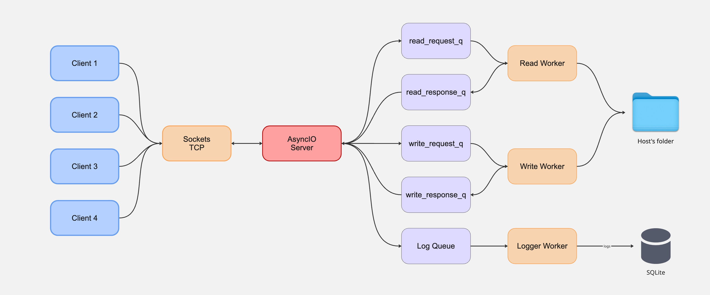

# Clisend

[English](README.md) | **Español**

Clisend es un sistema educativo de transferencia de archivos cliente-servidor escrito en Python. Combina `asyncio` para gestionar conexiones TCP concurrentes con procesos worker dedicados a operaciones de archivos y registro de eventos en SQLite.



## Arquitectura

El servidor TCP acepta múltiples clientes e intercambia mensajes de control JSON enmarcados por longitud, seguidos por los bytes crudos del archivo cuando corresponde. Las solicitudes de lectura se delegan a un worker con un pool de hilos, las operaciones de escritura se serializan mediante un worker dedicado y un worker de logging persiste los eventos de transferencia en SQLite.

El prefijo de longitud proporciona un framing confiable de mensajes sobre TCP. **No** proporciona cifrado, autenticación, autorización ni integridad criptográfica.

## Características

- Gestión concurrente de clientes con `asyncio`.
- Procesos worker separados para lectura, escritura y logging.
- Protocolo JSON con prefijo de longitud para comandos y metadatos.
- Operaciones de subida, descarga, listado, vista previa, eliminación y corte.
- Contención de rutas dentro de un directorio compartido configurado.
- Registro de eventos de transferencia en SQLite (`logs.db`).

## Ejecutar el servidor

Por defecto, el servidor escucha en el puerto `65432` y comparte el directorio actual.

```bash
python3 server.py
```

Opciones del servidor:

- `-p`, `--port`: cambiar el puerto.
- `-f`, `--folder`: elegir el directorio compartido.
- `--host`: elegir la interfaz de red.
- `--db`: elegir la ruta de la base SQLite de logs.

## Ejecutar un cliente

El argumento posicional es un nombre visible utilizado en los logs; no representa una identidad autenticada.

```bash
python3 client.py "Usuario"
```

Opciones del cliente:

- `--host`: dirección IP o hostname del servidor.
- `-p`, `--port`: puerto del servidor.
- `-d`, `--download-dir`: destino local de los archivos descargados.

## Comandos del cliente

- `ls [ruta]`: listar archivos y directorios.
- `cp <archivo>`: descargar un archivo.
- `put <archivo_local>`: subir un archivo.
- `rm <archivo>`: eliminar permanentemente un archivo remoto.
- `cut <archivo>`: descargar y luego eliminar un archivo remoto.
- `help`: mostrar los comandos disponibles.
- `exit`: desconectarse.

## Modelo de seguridad

Clisend está diseñado con fines educativos y para utilizarse en una máquina local o una red confiable. Asume que los clientes y la red son de confianza. El servidor mantiene las rutas solicitadas dentro del directorio compartido configurado, pero no autentica clientes ni asigna permisos por usuario.

No se debe exponer el servidor directamente a Internet ni utilizarlo para transferir archivos sensibles sin añadir transporte seguro y una capa de autenticación y autorización.

## Limitaciones actuales

- El tráfico TCP no está cifrado con TLS.
- Los nombres de cliente no representan identidades autenticadas.
- Todos los clientes conectados tienen los mismos permisos sobre los archivos.
- Algunas transferencias se cargan completamente en memoria.
- Todavía no se aplican límites de tamaño a mensajes y uploads.
- La configuración de multiprocessing utiliza `fork` y, por lo tanto, está orientada a sistemas tipo Unix.
